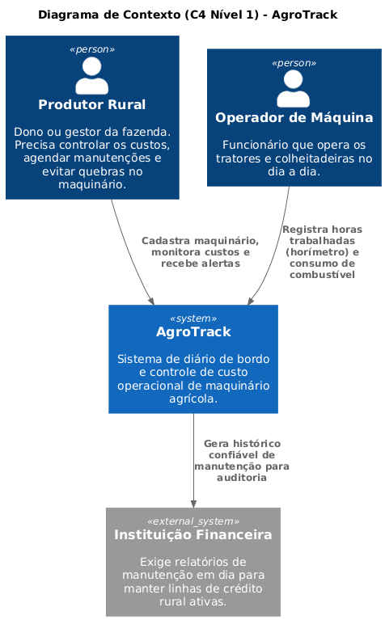
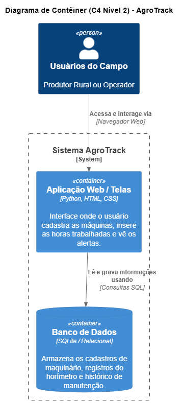
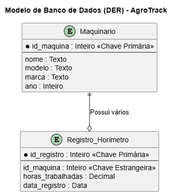
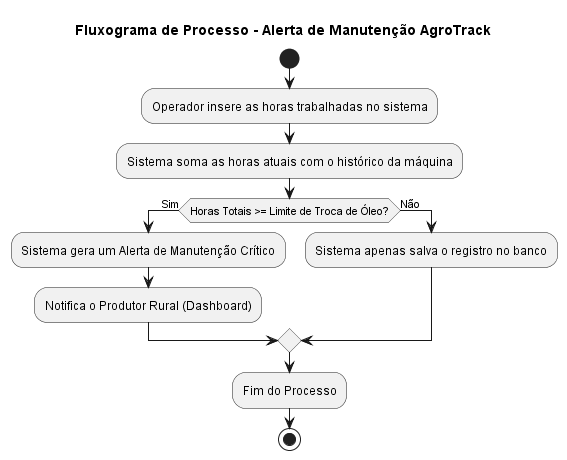

# projeto-software-agro-diario-de-bordo

Sistema de diário de bordo e custo operacional de maquinário agrícola

## 📌 Sobre o Projeto
Tratores e colheitadeiras geram custos altíssimos por hora trabalhada, 
principalmente devido ao consumo de óleo diesel e à falta de controle 
sobre manutenções preventivas. Esse cenário leva produtores rurais a 
gastos evitáveis e a quebras inesperadas de máquinas em plena safra.

O **AgroTrack** resolve essa dor permitindo o registro digital do 
horímetro (horas de uso) de cada máquina, o acompanhamento do consumo 
de combustível (L/h) e o disparo de alertas automáticos de manutenção 
com base no tempo de uso — ajudando o produtor a reduzir custos 
operacionais e evitar paradas não planejadas.

## 👥 Integrantes do Grupo
- Fabricio Marques da Cunha
- Eduardo Fernandes Silva
- Ian Gustavo Sanajiotto Dias
- Hiago Rafael Fernandes do Amaral
## 🛠️ Funcionalidades Principais
- Cadastro de Maquinário
- Registro de Horímetro (horas trabalhadas)
- Registro de Abastecimento e Consumo de Combustível
- Alertas de Manutenção Preventiva

## 📐 Arquitetura do Sistema

### Diagrama de Contexto (C4 Nível 1)

### Diagrama de Contêiner (C4 Nível 2)

### Modelo do Banco de Dados (DER)

### Fluxograma do Processo

